# CI/CD Pipeline with AWS: Capstone Project Documentation

## Project Overview

This document is my trainee capstone submission for a DevOps upskilling program. The main objective of this project was to design and implement an end-to-end CI/CD pipeline on AWS for a simple Java web application.

My goal was to start from source code in GitHub and reach a fully automated deployment on an EC2 instance, with minimal manual intervention after the initial setup.

Core workflow that I implemented:

**GitHub → CodePipeline → CodeArtifact → CodeBuild → CodeDeploy → EC2**

Throughout this document, I describe what I did, why I did it, what I learned, and I include screenshots (or placeholders) that demonstrate each major step.

> **Note:** All screenshots should be stored in a `screenshots/` folder in the repository. The paths below are aligned with the screenshot names I used during the project.

---

## 1. Launch EC2 and Web Server Setup

In this first stage, I prepared the target environment (the web server) where the application would be deployed. This part helped me understand the basics of provisioning infrastructure and installing the required runtime tools.

| **Task** | **Description** |
| --- | --- |
| **Instance Launch** | Launched an Amazon EC2 instance (Amazon Linux 2 AMI) in the target region (for example, `us-east-1`). |
| **Initial Setup** | Connected to the instance via SSH and performed system updates (`sudo yum update -y`). |
| **Prerequisites** | Installed essential development tools such as **Java (JDK)** and **Maven**. |
| **Bootstrap Application** | Used Maven to quickly create a basic, runnable **Java Web Application** (`.war` file) template to serve as the application payload. |
| **Agent Installation** | Installed and verified the **AWS CodeDeploy Agent** on the EC2 instance so that CodeDeploy could manage deployments on this server. |

From this stage, I became more comfortable with SSH access, Linux package management, and verifying that services (like the CodeDeploy agent) are running correctly.

#### Screenshots for EC2 instance
- 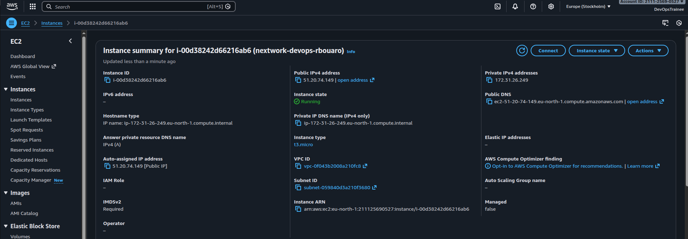  
  _Screenshot of the EC2 instance details page showing the instance in a running state._
- 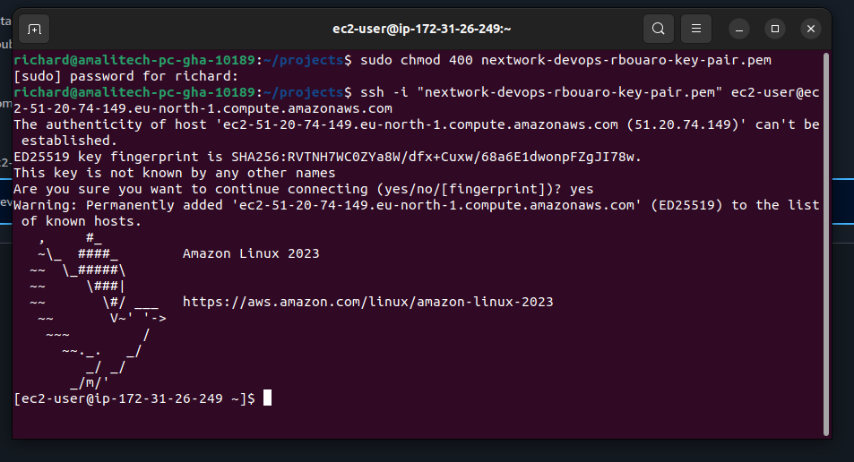  
  _Screenshot of the terminal connected via SSH with system update commands executed._
- 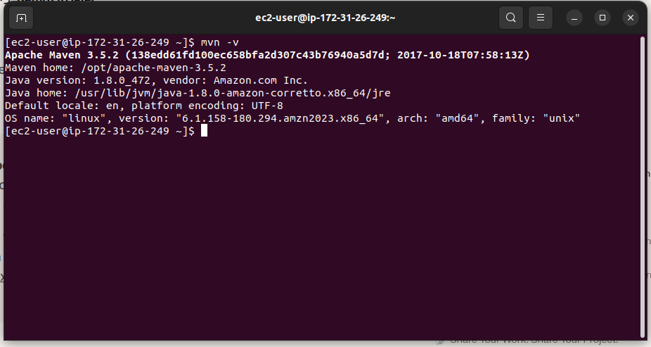  
  _Screenshot showing Maven and Java installed and verified on the instance._
- 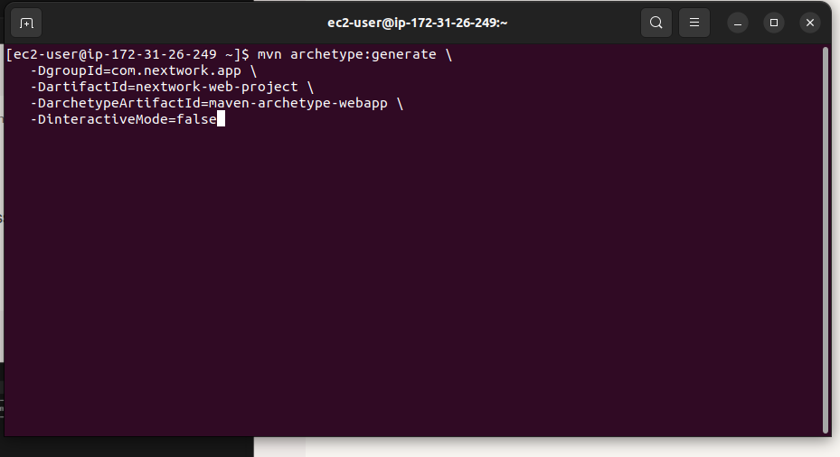  
  _Screenshot showing the Maven command used to bootstrap the Java web application._

---

## 2. Git and GitHub

Next, I focused on version control and setting up the GitHub repository as the single source of truth. This step was important for enabling automated builds whenever I push new code.

| **Task** | **Description** |
| --- | --- |
| **Repository Setup** | Hosted the Java application code in a GitHub repository (for example: `rbouaro-se/nextwork-web-project`). |
| **Version Control** | Tracked all application code, `pom.xml`, and deployment configuration files like `buildspec.yml` and `appspec.yml` in the same repository. |

This stage reinforced my understanding of Git basics, branching, commits, and how GitHub integrates with AWS services for CI/CD.

#### Screenshots for Stage 2
- 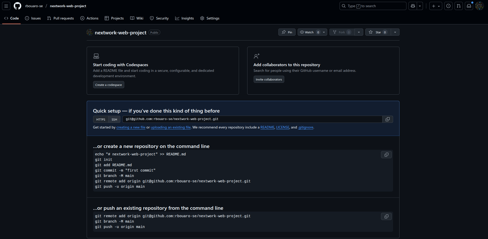  
  _Screenshot of the GitHub repository showing the main project files and structure._

---

## 3. AWS CodeArtifact

In this stage, I set up AWS CodeArtifact to act as a managed Maven repository. The main learning point here was how to centralize and secure dependency management for the build process.

| **Task** | **Description**                                                                                                                                   |
| --- |---------------------------------------------------------------------------------------------------------------------------------------------------|
| **Domain & Repository** | Created a CodeArtifact Domain and a dedicated Maven repository (for example, `nextwork-devops-capstone-cicd`).                                    |
| **Upstream Configuration** | Configured the repository to use public upstream sources like **Maven Central** so dependencies could be fetched and cached through CodeArtifact. |
| **Access Configuration** | Updated the **CodeBuild** service role permissions to allow secure access to the CodeArtifact domain and repository.                              |
| **Maven Settings (`settings.xml`)** | Configured Maven (`settings.xml` and/or commands in `buildspec.yml`) to point to the CodeArtifact repository endpoint for dependency resolution.  |

By completing this part, I learned how to integrate a private artifact repository into the CI process and how credentials are handled securely in AWS.

#### Screenshots for Stage 3
- 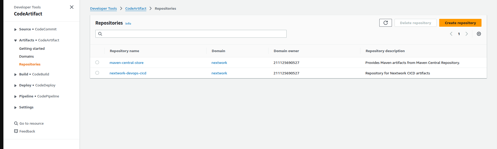  
  _Screenshot of the CodeArtifact domain and repository configuration screen._

---

## 4. AWS CodeBuild

With source control and dependencies ready, I moved on to the Continuous Integration part of the pipeline using AWS CodeBuild. Here, I automated the build and packaging of the Java web application.

| **Task** | **Description** |
| --- | --- |
| **Project Creation** | Created a CodeBuild project using CodePipeline as the source, selecting an appropriate Java runtime image and assigning an IAM role. |
| **`buildspec.yml`** | Defined the build process in `buildspec.yml`, including: |
|  | - **`install`**: Commands to authenticate with CodeArtifact and install any additional tools. |
|  | - **`build`**: The main build step using `mvn clean package` to compile and package the app into a `.war` file. |
|  | - **`post_build`**: Commands to bundle the `.war` file and `appspec.yml` into a zip archive for deployment. |
| **Artifact Output** | Configured CodeBuild to send the final zipped artifact to an S3 artifact bucket that CodePipeline and CodeDeploy could consume. |

This step helped me understand how build logs, environment variables, and IAM roles work together in an automated build environment.

#### Screenshots for Stage 4
- 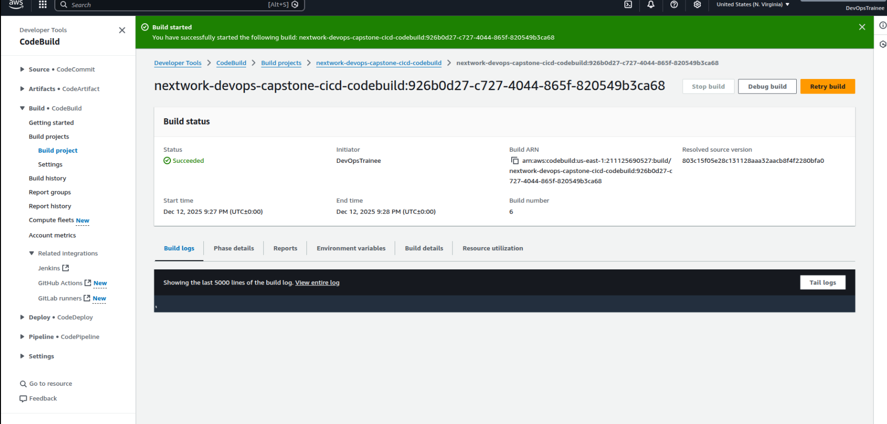  
  _Screenshot of a successful CodeBuild run showing the build phases and logs._

---

## 5. AWS CodeDeploy

Once the build artifacts were ready, I configured AWS CodeDeploy to manage the deployment of the application onto the EC2 instance. This stage focused on automating the deployment steps and handling failures safely.

| **Task** | **Description** |
| --- | --- |
| **Application & Deployment Group** | Created a CodeDeploy Application and a Deployment Group targeting the EC2 instance using tags. |
| **Deployment Configuration** | Used a deployment configuration such as `CodeDeployDefault.OneAtATime` to control the pace of deployments. |
| **`appspec.yml`** | Used `appspec.yml` to define: |
|  | - **Files**: Which files to copy from the artifact to specific directories on the EC2 instance (for example, the Tomcat `webapps` folder). |
|  | - **Hooks**: Lifecycle events like **`ApplicationStop`**, **`BeforeInstall`**, **`AfterInstall`**, and **`ApplicationStart`** with shell scripts in the `scripts/` folder. |
| **Rollback** | Tested failure scenarios (such as errors in the `ApplicationStart` script) to see CodeDeploy automatically roll back to the last successful deployment. |

By implementing this stage, I gained hands-on experience with deployment strategies, validation tests, and rollback mechanisms.

#### Screenshots for Stage 5
- 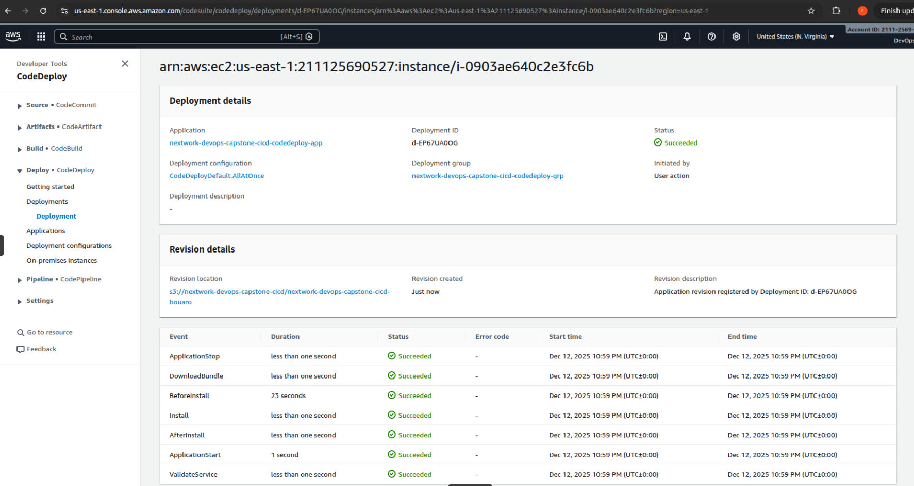  
  _Screenshot of a successful CodeDeploy deployment to the target EC2 instance._
- 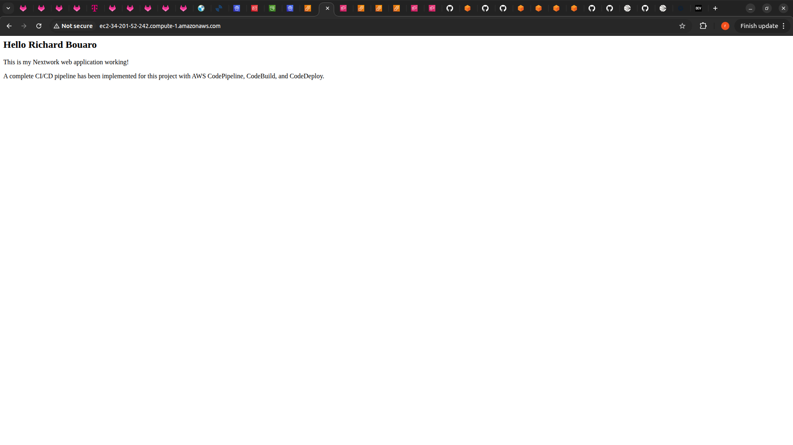  
  _Screenshot of the deployed Maven web application running in the browser._

---

## 6. CloudFormation (Infrastructure as Code)

After manually setting up several components, I used AWS CloudFormation to capture the infrastructure as code. This ensured the environment could be recreated or updated in a controlled and repeatable way.

| **Task** | **Description** |
| --- | --- |
| **IaC Principle** | Applied the Infrastructure as Code principle to make the environment reproducible and version-controlled. |
| **Template Generation** | Exported the architecture (EC2 instance, Security Groups, IAM roles, S3 buckets, and CodeDeploy configuration) into a single YAML CloudFormation template. |
| **Stack Management** | Used the CloudFormation template to create or update stacks, allowing the entire environment to be deployed programmatically. |
| **Reusability** | Treated the template as a reusable blueprint that can be adapted for future projects or additional environments. |

This stage helped me understand how to move from manual console-based setup to automated infrastructure provisioning.

#### CloudFormation Template
- [CloudFormation template file](nextwork-devops-cicd-cloudformation-template.yaml)  
  _Link to the CloudFormation template used to describe the CI/CD infrastructure._

---

## 7. AWS CodePipeline (End-to-End Orchestration)

Finally, I brought everything together with AWS CodePipeline. CodePipeline acts as the orchestrator, connecting GitHub, CodeBuild, and CodeDeploy into one continuous flow.

| **Stage** | **Action** | **Service** | **Details** |
| --- | --- | --- | --- |
| **Source** | Source | GitHub | Monitors the GitHub repository for changes and triggers the pipeline on each push. |
| **Build** | Build | CodeBuild | Retrieves the latest source, authenticates with CodeArtifact, runs `mvn clean package`, and uploads the build artifact to S3. |
| **Deploy** | Deploy | CodeDeploy | Uses the artifact from S3 and applies the deployment instructions in `appspec.yml` to update the EC2 instance. |

| **Task** | **Description** |
| --- | --- |
| **Pipeline Creation** | Created a multi-stage pipeline that connects the GitHub repository (Source), the CodeBuild project (Build), and the CodeDeploy application (Deploy). |
| **Artifact Flow** | Configured artifact buckets in S3 to pass build outputs from one stage to the next. |
| **Automation** | Verified that a code change in GitHub automatically triggered the pipeline and resulted in a new version of the application running on the EC2 instance. |

This final stage gave me a complete view of how CI/CD pipelines are built in the real world, including triggers, stages, and the importance of good feedback from each step.

#### Screenshots for Stage 7
-   
  _Screenshot of the full pipeline in the CodePipeline console showing all stages._
- 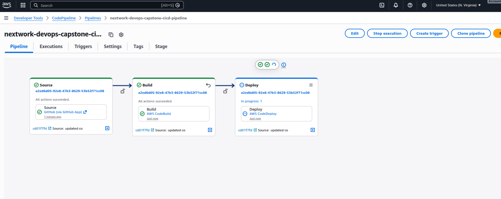  
  _Screenshot of the execution history showing a successful run triggered by a Git push._
- 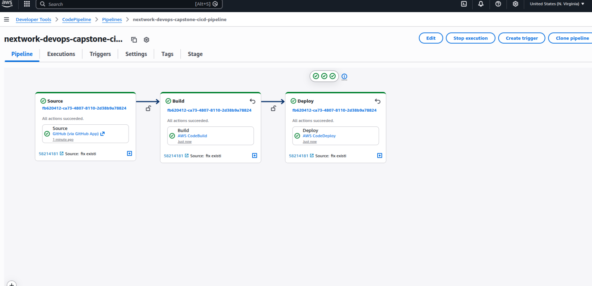  
  _Screenshot of the running web application in the browser, demonstrating that the latest code changes have been deployed._

---

## Reflections and Learning Outcomes

By completing this capstone project, I was able to:

- Practice setting up and managing an EC2 instance as a deployment target.
- Use Git and GitHub as the foundation for source control and collaboration.
- Configure AWS CodeArtifact to handle dependencies securely for Maven builds.
- Build a Java web application automatically using AWS CodeBuild and `buildspec.yml`.
- Deploy the application reliably to an EC2 instance using AWS CodeDeploy and lifecycle hooks.
- Capture the infrastructure as code using AWS CloudFormation.
- Orchestrate all pieces into a working CI/CD pipeline using AWS CodePipeline.

Overall, this project strengthened my understanding of DevOps concepts such as automation, repeatability, and feedback loops. It also gave me practical experience with core AWS DevOps services that I can apply to more complex, production-grade pipelines in the future.